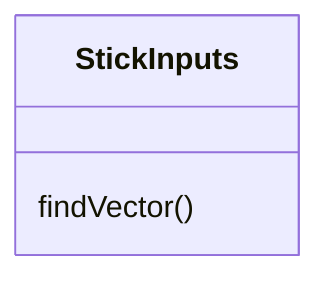

 - Will take initialized gamepad1 object for stick inputs
 - Returns Theta and Magnitude of vector
 -
  ```mermaid
   classDiagram
       class Drive
  
       Drive : drive(theta, magnitude)
  ```
- Will take initialized DcMotor objects of the motors
- Will drive in the direction of the theta and at the speed of magnitude
