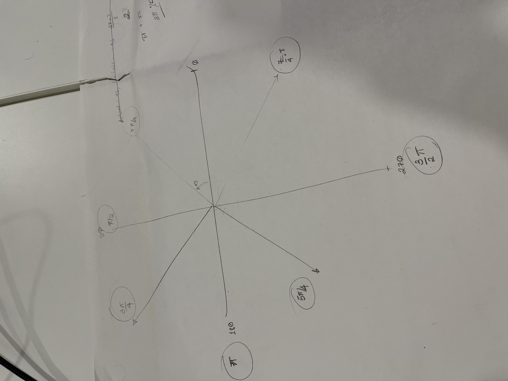

# Robot Direction Map

This is a diagram of the way the robot will use angles to determine directions.

90 degrees will be forward, 0 degrees right, 270 degrees backwards, and 180 
degrees backwards. The robot uses these values as radians.

